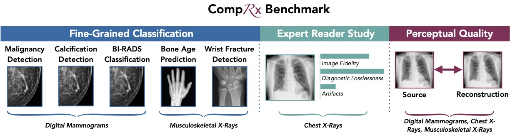

# CompRx: A Benchmark for Diagnostically Lossless Compression of Medical Images


## 🫁 Overview
Medical images are often acquired at high resolutions (>1 megapixel) in order to capture fine-grained details necessary for diagnosis. CompRx is a benchmark with clinically-relevant evaluation tasks that measure the preservation of fine-grained diagnostic features in compressed medical images.

## ⚡️ Installation
```python
pip install -e .
pip install -r requirements.txt
pre-commit install
pre-commit
```

Update `.env` with the filepath of your project folder on disk. Then, run `accelerate config` to generate a config file, and copy it from `~/cache/huggingface/accelerate/default_config.yaml` to the project directory. Finally, create symlinks from the `data/` folder to the datasets you want to train on.

## ⚙️ Med-VAE

The `train_vae.py` script can be used to train *Med-VAE*.

```python
# Train VAE (edit vae.yaml in order to control loss and autoencoder parameters)
accelerate launch comprx/train_vae.py experiment=vae
```

The `infer_vae.py` script can be used to cache latents.

```python
# After training VAE, cache learned latents
accelerate launch --num_processes=1 comprx/infer_vae.py experiment=vae_inference csv_stem=malignancy img_size=64 paths.inference_output_dir=/admin/home-sluijs/comprx/data/tmp/ num_latent_channels=1 model.ddconfig.ch_mult=[1,2,4,4] resume_from_ckpt=/fsx/aimi/vae-checkpoints/15000/8x1/step_15000.pt dataset_ids=[1]
```

## 🩺 CompRx Tasks

### Fine-Grained Classification
To train a classifier, use the `comprx/train_cls.py` script.

```bash
# Malignancy Detection
accelerate launch comprx/train_cls.py \
    experiment=cls_bicubic_malignancy
    dataset_id=2 \
    data_subdir=256 \
    model.backbone=resnet50 \
    model.freeze=True \  # defaults to True
    ckpt_path=/path/checkpoints/last.pt/pytorch_model.bin

# BI-RADS Prediction
accelerate launch comprx/train_cls.py \
    experiment=cls_bicubic_birads \
    data_subdir=256 \
    odel.backbone=resnet50 \
    ckpt_path=/path/checkpoints/last.pt/pytorch_model.bin

# Calcification Detection
accelerate launch comprx/train_cls.py \
    experiment=cls_bicubic_calcification \
    dataset_id=2 \
    data_subdir=256 \
    model.backbone=resnet50 \
    ckpt_path=/path/checkpoints/last.pt/pytorch_model.bin

# Bone Age Prediction
accelerate launch comprx/train_cls.py \
    experiment=cls_bicubic_boneage \
    dataset_id=9 \
    data_subdir=256 \
    model.backbone=resnet50 \
    ckpt_path=/path/checkpoints/last.pt/pytorch_model.bin

# Pediatric Wrist Fracture Detection
accelerate launch comprx/train_cls.py \
    experiment=cls_bicubic_fracture \
    dataset_id=10 \
    data_subdir=256 \
    model.backbone=resnet50 \
    ckpt_path=/path/checkpoints/last.pt/pytorch_model.bin


# Use ImageNet pretrained weights
accelerate launch comprx/train_cls.py experiment=... +model.pretrained=True
```

### Perceptual Quality
To evaluate perceptual quality, use the `comprx/compute_vae_rec_metrics.py` script.
```python
python3 comprx/compute_vae_rec_metrics.py \
    experiment=vae_metrics \
    resume_from_ckpt=bicubic-4x \
    img_size=768 \
    seed=0 
```

## 📚 Datasets
Each dataset uses the same `Dataset` named `GenericDataset`. This dataset is reliant on a single CSV file in which the user is able to specify columns with information about either splits, images, labels or text. The corresponding `_transform` methods can be used to transform these column values to representations that can be used in the ML-pipeline. Here are two examples for CANDID-PTX and RSNA Mammo, respectively.

```python
from comprx.dataloaders import GenericDataset

ds = GenericDataset(
    split_path="/path/candid/splits/train.csv",
    data_dir="/path/candid/data/1024",
    dataset_id=0,
    img_column="image_uuid",
    img_suffix=".img.npy",
    img_transform=load_tensor,
    lbl_columns=["ptx", "fracture", "chest_tube"],
    lbl_transform=load_labels,
    txt_column="report",
    txt_transform=lambda x: x,
)
```

The `ZarrLoader` used in the example below allows for efficient random cropping without having to load the complete array buffer into memory.

```python
from functools import partial

ds = GenericDataset(
    split_path="/path/rsna/splits/malignancy.csv",
    split_column="split",
    split_name="train",
    data_dir="/path/rsna/mammogram/mg-1/data",
    dataset_id=0,
    img_column="image_uuid",
    img_transform=ZarrLoader(size=512),
    lbl_columns=["BIRADS"],
    lbl_transform=partial(load_labels, dtype=torch.long, fill_null=0),
)
```

## 🖥️ Acknowledgments
This repository is powered by [Hydra](https://github.com/facebookresearch/hydra) and [HuggingFace Accelerate](https://github.com/huggingface/accelerate). Our implementation of Med-VAE is inspired by prior work on diffusion models from [CompVis](https://github.com/CompVis/latent-diffusion) and [Stability AI](https://github.com/Stability-AI/stablediffusion). 